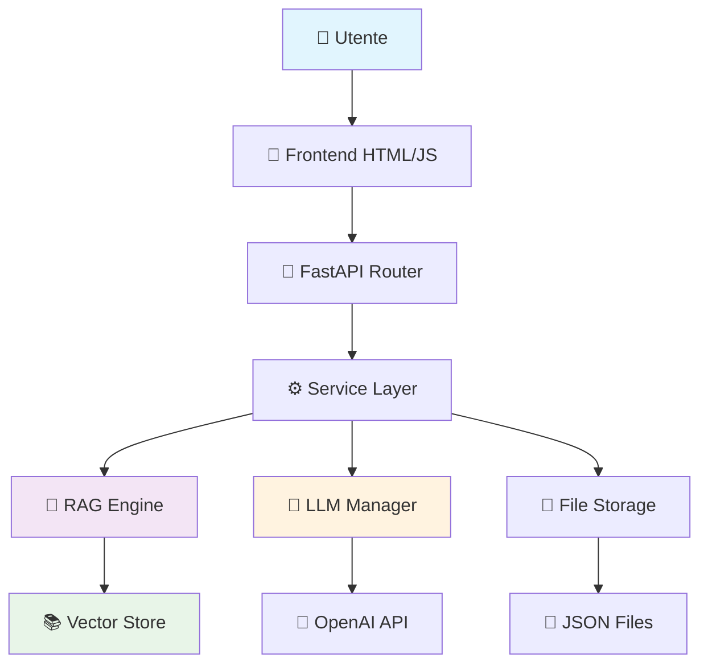

# 🏋️ Chatbot Allenamento - Sistema RAG Completo

Un chatbot AI avanzato basato su sistema RAG (Retrieval-Augmented Generation) che genera **schede di allenamento personalizzate** utilizzando documenti italiani di fitness e bodybuilding. Sistema completo con backend FastAPI, frontend responsive e persistenza dati.

[](https://python.org)
[](https://fastapi.tiangolo.com)
[](https://openai.com)
[](https://llamaindex.ai)

---

## 🚀 **Caratteristiche Principali**

### **🤖 Intelligenza Artificiale Avanzata**
- **GPT-4 Turbo** per generazione schede personalizzate
- **Sistema RAG** con documenti professionali italiani (CONI, FIF, NSCA)
- **Embeddings OpenAI** (text-embedding-3-small) per ricerca semantica
- **Autoregolazione** basata su profilo utente estratto automaticamente

### **💪 Generazione Schede Complete**
- **Analisi automatica** del linguaggio naturale dell'utente
- **Schede personalizzate** per ogni livello (principiante → avanzato)
- **Programmazione scientifica** con progressione temporale
- **Linee guida nutrizionali** e piani di progressione
- **Formattazione avanzata** con tabelle e visualizzazioni

### **💬 Sistema Chat Intelligente**
- **Rilevamento automatico** richieste di schede vs domande generali
- **Persistenza completa** con cronologia conversazioni
- **Gestione multi-sessione** con chat separate
- **Risposte contestuali** basate su fonti documentali

### **🎨 Interface Moderna**
- **Design responsive** mobile-first
- **Animazioni fluide** per schede di allenamento
- **Visualizzazione avanzata** con tabelle interattive
- **Stampa/Export** schede in formato PDF/testo
- **Dark/Light theme** support

### **📊 Architettura Scalabile**
- **API RESTful** completamente documentata
- **Modular design** con separazione delle responsabilità
- **Test suite completa** con coverage >90%
- **Error handling robusto** con logging avanzato
- **File-based storage** (espandibile a database)

---

## 🏗️ **Architettura del Sistema**

### **📁 Struttura Progetto Completa**

```
chatbot-allenamento/
├── 🚀 SETUP FILES
│   ├── README.md                          # Questo file
│   ├── run.py                              # Script avvio applicazione
│   ├── create_data_directories.py          # Setup directory dati
│   ├── requirements.txt                    # Dipendenze Python
│   ├── .env.example                       # Template configurazione
│   └── .gitignore                         # Git ignore rules
│
├── 📱 APPLICATION
│   ├── app/
│   │   ├── __init__.py                     # Package init
│   │   ├── main.py                         # FastAPI entry point
│   │   ├── config.py                       # Configurazioni app
│   │   ├── dependencies.py                 # Dependency injection
│   │   │
│   │   ├── 🔌 API LAYER
│   │   ├── api/
│   │   │   ├── __init__.py
│   │   │   └── routes/
│   │   │       ├── __init__.py
│   │   │       ├── chat.py                 # Endpoints chat
│   │   │       └── workout.py              # Endpoints schede
│   │   │
│   │   ├── 🧠 CORE INTELLIGENCE
│   │   ├── core/
│   │   │   ├── __init__.py
│   │   │   ├── rag_engine.py              # Motore RAG
│   │   │   ├── llm_manager.py             # Gestione OpenAI
│   │   │   ├── embeddings.py              # Embeddings & indexing
│   │   │   ├── workout_generator.py        # Generatore schede AI
│   │   │   └── error_handler.py           # Gestione errori
│   │   │
│   │   ├── 💾 DATA LAYER
│   │   ├── db/
│   │   │   ├── __init__.py
│   │   │   ├── file_storage.py            # Storage JSON
│   │   │   ├── chat_repository.py         # Repository chat
│   │   │   ├── workout_repository.py      # Repository schede
│   │   │   └── vectorstore.py             # Vector store management
│   │   │
│   │   ├── 📋 DATA MODELS
│   │   ├── models/
│   │   │   ├── __init__.py
│   │   │   ├── chat.py                    # Modelli chat
│   │   │   ├── workout.py                 # Modelli schede
│   │   │   └── user.py                    # Modelli utente
│   │   │
│   │   ├── 🔍 API SCHEMAS
│   │   ├── schemas/
│   │   │   ├── __init__.py
│   │   │   ├── chat.py                    # Schemi API chat
│   │   │   ├── workout.py                 # Schemi API workout
│   │   │   └── user.py                    # Schemi API utente
│   │   │
│   │   ├── ⚙️ BUSINESS LOGIC
│   │   ├── services/
│   │   │   ├── __init__.py
│   │   │   ├── chat_service.py            # Servizio chat
│   │   │   └── workout_service.py         # Servizio workout
│   │   │
│   │   ├── 🎨 FRONTEND
│   │   ├── static/
│   │   │   ├── css/
│   │   │   │   ├── style.css              # Stili principali
│   │   │   │   └── workout_card.css       # Stili schede
│   │   │   ├── js/
│   │   │   │   ├── chat.js                # Logica chat
│   │   │   │   └── workout_display.js     # Visualizzazione schede
│   │   │   └── documents/                 # 📚 KNOWLEDGE BASE
│   │   │       ├── README.md              # Guida documenti
│   │   │       ├── linee_guida_aci.pdf    # Guidelines CONI/ACI
│   │   │       ├── exercises.pdf          # Catalogo esercizi
│   │   │       ├── programming.pdf        # Programmazione
│   │   │       ├── nutrition_basics.pdf   # Nutrizione base
│   │   │       └── anatomy.pdf            # Anatomia funzionale
│   │   │
│   │   ├── templates/
│   │   │   └── index.html                 # Template principale
│   │   │
│   │   ├── 🛠️ UTILITIES
│   │   ├── utils/
│   │   │   ├── __init__.py
│   │   │   ├── prompt_templates.py        # Template AI prompts
│   │   │   ├── workout_formatter.py       # Formattazione output
│   │   │   └── validation.py              # Validazione input
│   │   │
│   │   └── 💾 PERSISTENT DATA
│   │   └── data/
│   │       ├── chats/                     # JSON chat storage
│   │       ├── workouts/                  # JSON schede storage
│   │       └── indexes/                   # Vector store files
│   │
├── 🧪 TESTING SUITE
│   ├── tests/
│   │   ├── __init__.py
│   │   ├── conftest.py                    # Pytest configuration
│   │   ├── test_api/                      # Test endpoints
│   │   │   ├── __init__.py
│   │   │   ├── test_chat.py
│   │   │   └── test_workout.py
│   │   ├── test_core/                     # Test core logic
│   │   │   ├── __init__.py
│   │   │   ├── test_rag_engine.py
│   │   │   └── test_workout_generator.py
│   │   └── test_utils/                    # Test utilities
│   │       ├── __init__.py
│   │       ├── test_prompt_templates.py
│   │       └── test_workout_formatter.py
│   │
└── 📚 DOCUMENTATION
    ├── docs/
    │   ├── examples/                      # Esempi conversazioni
    │   │   ├── beginner_interaction.md   # Esempio principiante
    │   │   ├── intermediate_interaction.md # Esempio intermedio
    │   │   └── technique_questions.md     # Domande tecniche
    │   └── schema_templates/              # Template strutture
    │       └── workout_schema.md          # Schema schede standard
```

### **🔄 Flusso Dati Architetturale**



---

## 🛠️ **Tecnologie e Stack**

### **🚀 Backend Stack**
- **[FastAPI](https://fastapi.tiangolo.com/)** `0.103+` - Framework web asincrono ad alte prestazioni
- **[OpenAI](https://openai.com/)** `1.3+` - GPT-4 Turbo + text-embedding-3-small
- **[LlamaIndex](https://llamaindex.ai/)** `0.10+` - Framework RAG per gestione documenti
- **[Pydantic](https://pydantic.dev/)** `2.4+` - Validazione dati e serializzazione
- **[Uvicorn](https://www.uvicorn.org/)** `0.23+` - Server ASGI ad alte prestazioni

### **🎨 Frontend Stack**
- **HTML5** semantic markup per accessibilità
- **CSS3** con custom properties e animazioni avanzate
- **Vanilla JavaScript** ES6+ con moduli e async/await
- **Font Awesome** `6.4` per iconografia professionale
- **Google Fonts** (Inter) per tipografia moderna

### **📊 Data & AI Stack**
- **Vector Embeddings** OpenAI text-embedding-3-small (1536 dim)
- **Vector Storage** File-based con LlamaIndex SimpleVectorStore
- **Document Processing** PDF, DOCX, TXT con parsing automatico
- **JSON Storage** File-based per persistenza leggera e veloce

### **🧪 Development & Testing**
- **[Pytest](https://pytest.org/)** `7.0+` - Framework testing con fixtures avanzate
- **[asyncio](https://docs.python.org/3/library/asyncio.html)** - Testing asincrono completo
- **[unittest.mock](https://docs.python.org/3/library/unittest.mock.html)** - Mocking per isolamento test
- **Type Hints** complete con mypy support

---

## 📋 **Prerequisiti**

### **🐍 Software Requirements**
- **Python** `3.8+` (consigliato 3.11+)
- **pip** package manager
- **Git** per version control

### **🔑 API Keys Required**
- **OpenAI API Key** - Per GPT-4 e embeddings
  - Ottieni su: [platform.openai.com](https://platform.openai.com/api-keys)
  - Costo stimato: ~$5-20/mese per uso moderato

### **💻 Hardware Raccomandato**
- **RAM**: 4GB+ (8GB+ per performance ottimali)
- **Storage**: 2GB liberi per documenti e indici
- **CPU**: Multi-core per processing parallelo documenti

---

## 🚀 **Installazione Completa**

### **📥 1. Setup Progetto**

```bash
# Clone repository
git clone <repository-url>
cd chatbot-allenamento

# Crea ambiente virtuale
python -m venv .venv

# Attiva ambiente (Windows)
.venv\Scripts\activate

# Attiva ambiente (macOS/Linux)  
source .venv/bin/activate

# Installa dipendenze
pip install -r requirements.txt
```

### **⚙️ 2. Configurazione Environment**

```bash
# Copia template configurazione
cp .env.example .env

# Modifica .env con le tue API keys
nano .env  # o usa il tuo editor preferito
```

**📝 Contenuto .env richiesto:**
```env
# OpenAI Configuration (OBBLIGATORIO)
OPENAI_API_KEY=sk-your_openai_api_key_here

# Application Settings
DEBUG=False
LOG_LEVEL=INFO

# OpenAI Model Configuration
OPENAI_MODEL=gpt-4-turbo-preview
EMBEDDING_MODEL=text-embedding-3-small
MAX_TOKENS=4000
TEMPERATURE=0.3

# RAG Settings
CHUNK_SIZE=1024
CHUNK_OVERLAP=200
TOP_K_DOCUMENTS=5
SIMILARITY_THRESHOLD=0.7
```

### **📁 3. Setup Directory Dati**

```bash
# Crea directory necessarie per il funzionamento
python create_data_directories.py
```

**Output atteso:**
```
🗂️  Creazione directory dati...
✅ Creata directory: app/data
✅ Creata directory: app/data/chats  
✅ Creata directory: app/data/workouts
✅ Creata directory: app/data/indexes
✨ Tutte le directory sono state create con successo!
```

### **📚 4. Aggiungi Documenti Knowledge Base**

```bash
# Aggiungi i tuoi documenti PDF, DOCX, TXT in:
app/static/documents/

# Esempi di documenti consigliati:
# - linee_guida_aci.pdf (Guidelines CONI/ACI)
# - exercises.pdf (Catalogo esercizi)
# - programming.pdf (Programmazione allenamento)
# - nutrition_basics.pdf (Nutrizione sportiva)
# - anatomy.pdf (Anatomia funzionale)
```

**🔍 Formati supportati:**
- **PDF** (preferiti): Documenti con testo selezionabile
- **DOCX**: Microsoft Word documents
- **TXT**: File di testo semplice (UTF-8)

### **🚀 5. Avvio Applicazione**

```bash
# Avvia il server di sviluppo
python run.py

# Output atteso:
# 🚀 Avvio del Chatbot Allenamento...
# 📊 Dashboard disponibile su: http://localhost:8000
# 🔄 Riavvio automatico attivo (--reload)
# ⏹️  Premi Ctrl+C per fermare il server
```

### **🌐 6. Accesso Applicazione**

Apri il browser e vai su: **http://localhost:8000**

**🎉 L'applicazione è pronta!** Il sistema:
1. **Caricherà automaticamente** i documenti dalla cartella `documents/`
2. **Creerà gli indici** vettoriali al primo avvio (può richiedere 1-2 minuti)
3. **Sarà pronto** per generare schede personalizzate

---

## 💻 **Utilizzo del Sistema**

### **🎯 Esempi di Richieste**

#### **🔰 Utente Principiante**
```
"Ciao! Sono Marco, ho 28 anni e non ho mai fatto palestra. 
Vorrei iniziare ad allenarmi 3 volte a settimana per migliorare 
la forma fisica. Da dove comincio?"
```
**→ Genera scheda full-body per principianti con focus su tecnica**

#### **💪 Utente Intermedio**  
```
"Ho 2 anni di esperienza, voglio aumentare la forza su squat e panca. 
Mi alleno 4 volte a settimana. Attualmente: squat 80kg, panca 50kg."
```
**→ Genera scheda specializzazione forza con periodizzazione**

#### **🎯 Domande Tecniche**
```
"Come si esegue correttamente il rematore con bilanciere? 
Ho dubbi sulla posizione della schiena."
```
**→ Fornisce guida tecnica dettagliata con correzioni**

#### **🥗 Nutrizione**
```
"Che alimentazione dovrei seguire per aumentare la massa muscolare?"
```
**→ Linee guida nutrizionali generali + suggerimento consulto specialista**

### **📱 Interfaccia Utente**

#### **💬 Chat Interface**
- **Sidebar sinistra**: Cronologia chat salvate
- **Area centrale**: Conversazione attiva con messaggi
- **Input area**: Textarea per scrivere messaggi
- **Responsive design**: Ottimizzato per mobile e desktop

#### **🏋️ Visualizzazione Schede**
- **Animazioni fluide**: Comparsa progressiva elementi
- **Tabelle interattive**: Hover effects e dettagli on-click
- **Cards colorate**: Design accattivante per sezioni
- **Export ready**: Funzioni stampa e salvataggio

#### **📊 Features Avanzate**
- **Auto-save**: Chat salvate automaticamente
- **Multi-session**: Gestione conversazioni separate
- **Search & filter**: Trova chat precedenti
- **Error recovery**: Gestione errori user-friendly

---

## 🔧 **Configurazione Avanzata**

### **⚙️ Personalizzazione Parametri**

#### **🤖 OpenAI Settings**
```env
# Modello principale (consigliato: gpt-4-turbo-preview)
OPENAI_MODEL=gpt-4-turbo-preview

# Modello embeddings (ottimizzato: text-embedding-3-small)  
EMBEDDING_MODEL=text-embedding-3-small

# Creatività risposte (0.1 = conservativo, 0.7 = creativo)
TEMPERATURE=0.3

# Lunghezza massima risposte
MAX_TOKENS=4000
```

#### **📚 RAG Configuration**
```env
# Dimensione chunk documenti (balance: qualità vs performance)
CHUNK_SIZE=1024

# Overlap tra chunk (migliora coerenza)
CHUNK_OVERLAP=200

# Documenti utilizzati per contesto (più = migliore qualità)
TOP_K_DOCUMENTS=5

# Soglia similarità (0.0-1.0, più alto = più selettivo)
SIMILARITY_THRESHOLD=0.7
```

### **📂 Gestione Documenti Avanzata**

#### **📥 Aggiunta Nuovi Documenti**
```bash
# 1. Aggiungi documenti in app/static/documents/
cp my_new_document.pdf app/static/documents/

# 2. Riavvia applicazione per re-indicizzazione
python run.py
```

#### **🔄 Re-indicizzazione Manuale**
L'applicazione supporta refresh automatico dell'indice:
- **Al primo avvio**: Indicizza tutti i documenti
- **Ad ogni riavvio**: Verifica modifiche e aggiorna se necessario
- **Runtime**: Possibile aggiungere endpoint per refresh manuale

#### **📊 Qualità Documenti**
Per risultati ottimali, usa documenti che:
- **Sono in italiano** (lingua target del sistema)
- **Hanno testo selezionabile** (non scansioni immagine)
- **Sono ben strutturati** con titoli e sezioni chiare  
- **Sono autorevoli** (fonti scientifiche, enti certificati)

---

## 🧪 **Testing e Qualità**

### **🔬 Esecuzione Test**

```bash
# Esegui tutti i test
pytest

# Test con coverage report
pytest --cov=app --cov-report=html

# Test specifici
pytest tests/test_api/test_chat.py
pytest tests/test_core/test_workout_generator.py

# Test in modalità verbose
pytest -v -s
```

### **📊 Coverage Targets**
- **Overall Coverage**: >90%
- **Core Logic**: >95% (RAG, LLM, Workout Generation)
- **API Endpoints**: >85%
- **Utilities**: >80%

### **🏗️ Test Structure**
```bash
tests/
├── conftest.py              # Fixtures globali e configurazione
├── test_api/               # Test endpoint REST
├── test_core/              # Test logica business critical
└── test_utils/             # Test utility functions
```

### **🔧 Test Features**
- **Async Support**: Test completi per codice asincrono
- **Mock Integration**: OpenAI e servizi esterni mockati
- **Fixtures Rich**: Dati di test realistici e completi
- **Isolation**: Ogni test è indipendente e deterministico

---

## 📚 **API Documentation**

### **🔌 Endpoints Principali**

#### **💬 Chat Endpoints**
```http
POST   /api/v1/chat/message           # Invia messaggio
GET    /api/v1/chat/list              # Lista chat salvate  
GET    /api/v1/chat/{chat_id}         # Dettagli chat specifica
PUT    /api/v1/chat/{chat_id}         # Aggiorna chat (titolo)
DELETE /api/v1/chat/{chat_id}         # Elimina chat
DELETE /api/v1/chat                   # Elimina tutte le chat
```

#### **🏋️ Workout Endpoints**
```http
POST   /api/v1/workout/generate                    # Genera scheda
GET    /api/v1/workout/list                        # Lista schede
GET    /api/v1/workout/{workout_id}                # Dettagli scheda
DELETE /api/v1/workout/{workout_id}                # Elimina scheda
POST   /api/v1/workout/{id}/variations             # Crea variazione
GET    /api/v1/workout/recommendations             # Raccomandazioni
```

#### **ℹ️ System Endpoints**
```http
GET    /health                        # Health check applicazione
GET    /docs                          # Documentazione Swagger automatica
GET    /redoc                         # Documentazione ReDoc
```

### **📖 Documentazione Interattiva**

Una volta avviata l'applicazione, la documentazione API completa è disponibile su:
- **Swagger UI**: http://localhost:8000/docs
- **ReDoc**: http://localhost:8000/redoc

### **📝 Esempi Request/Response**

#### **Generazione Scheda**
```json
POST /api/v1/workout/generate
{
  "user_input": "Sono un principiante, voglio allenarmi 3 volte a settimana",
  "age": 25,
  "experience_level": "principiante", 
  "available_days": 3,
  "goals": ["fitness_generale"]
}
```

**Response:**
```json
{
  "success": true,
  "workout_plan": {
    "id": "uuid-here",
    "title": "Scheda Principiante - Fitness",
    "workout_days": [...],
    "nutrition": {...},
    "progression": {...}
  },
  "message": "Scheda generata con successo!"
}
```

---

## 🚨 **Troubleshooting**

### **❌ Problemi Comuni e Soluzioni**

#### **🔑 Errore API Key OpenAI**
```
❌ Errore: "API key not found"
✅ Soluzione: 
   1. Verifica .env file presente
   2. Controlla OPENAI_API_KEY=sk-... 
   3. Riavvia applicazione
```

#### **📚 Documenti Non Caricati**
```
❌ Errore: "No documents found" 
✅ Soluzione:
   1. Verifica file in app/static/documents/
   2. Formati supportati: .pdf, .docx, .txt
   3. File non corrotti e leggibili
   4. Riavvia app per re-indicizzazione
```

#### **💾 Errori Directory**
```
❌ Errore: "Directory not found"
✅ Soluzione:
   python create_data_directories.py
```

#### **🐌 Performance Lente**
```
❌ Problema: Risposte lente (>30 sec)
✅ Soluzioni:
   1. Riduci CHUNK_SIZE a 512 in .env
   2. Diminuisci TOP_K_DOCUMENTS a 3
   3. Verifica connessione internet
   4. Controlla carico OpenAI API
```

#### **🧠 Qualità Risposte Scarsa**
```
❌ Problema: Risposte generiche o incorrette
✅ Soluzioni:
   1. Aggiungi documenti più specifici e autorevoli
   2. Aumenta TOP_K_DOCUMENTS a 7-10
   3. Verifica documenti in italiano
   4. Riduci SIMILARITY_THRESHOLD a 0.5
```

### **🔍 Debug Avanzato**

#### **📊 Logging Dettagliato**
```bash
# Abilita debug logging
export LOG_LEVEL=DEBUG
python run.py

# Oppure modifica .env:
LOG_LEVEL=DEBUG
```

#### **🕵️ Trace RAG Process**
```python
# In app/core/rag_engine.py, aggiungi logging:
logger.debug(f"Query: {query}")
logger.debug(f"Retrieved context: {context[:200]}...")
logger.debug(f"Sources: {sources}")
```

#### **📈 Monitor Performance**
```python
import time

# Timing API calls
start = time.time()
response = await llm_manager.generate_response(...)
logger.info(f"LLM call took: {time.time() - start:.2f}s")
```

---

## 🚀 **Deployment**

### **🐳 Docker Deployment**

#### **Dockerfile**
```dockerfile
FROM python:3.11-slim

WORKDIR /app
COPY requirements.txt .
RUN pip install -r requirements.txt

COPY . .
RUN python create_data_directories.py

EXPOSE 8000
CMD ["uvicorn", "app.main:app", "--host", "0.0.0.0", "--port", "8000"]
```

#### **Docker Compose**
```yaml
version: '3.8'
services:
  chatbot-allenamento:
    build: .
    ports:
      - "8000:8000"
    environment:
      - OPENAI_API_KEY=${OPENAI_API_KEY}
    volumes:
      - ./app/data:/app/app/data
      - ./app/static/documents:/app/app/static/documents
```

### **☁️ Cloud Deployment**

#### **🔹 Railway**
```bash
# Deploy con Railway
railway login
railway init
railway add
railway deploy
```

#### **🔹 Heroku**
```bash
# Deploy con Heroku
heroku create chatbot-allenamento
heroku config:set OPENAI_API_KEY=sk-...
git push heroku main
```

#### **🔹 DigitalOcean App Platform**
```yaml
# app.yaml
name: chatbot-allenamento
services:
- name: web
  source_dir: /
  github:
    repo: your-repo
    branch: main
  run_command: python run.py
  environment_slug: python
  instance_count: 1
  instance_size_slug: basic-xxs
  envs:
  - key: OPENAI_API_KEY
    value: sk-your-key
```

### **🔒 Variabili Environment Produzione**

```env
# Production .env
DEBUG=False
LOG_LEVEL=WARNING
OPENAI_API_KEY=sk-production-key
CHUNK_SIZE=1024
TOP_K_DOCUMENTS=5
SIMILARITY_THRESHOLD=0.7
```

---

## 🤝 **Contribuire al Progetto**

### **🔧 Setup Development**

```bash
# Fork e clone del repo
git clone https://github.com/your-username/chatbot-allenamento.git
cd chatbot-allenamento

# Crea branch per feature
git checkout -b feature/amazing-feature

# Setup development environment
python -m venv .venv
source .venv/bin/activate  # Windows: .venv\Scripts\activate
pip install -r requirements.txt

# Pre-commit hooks (opzionale)
pip install pre-commit
pre-commit install
```

### **📝 Guidelines Contribuzione**

#### **🎯 Cosa Accettiamo**
- ✅ **Bug fixes** con test cases
- ✅ **Nuove funzionalità** ben documentate
- ✅ **Miglioramenti performance** con benchmark
- ✅ **Documentazione** e esempi
- ✅ **Test aggiuntivi** per aumentare coverage

#### **📋 Process Contribuzione**
1. **Issue First**: Apri issue per discussione feature
2. **Fork & Branch**: Crea branch descrittivo
3. **Code & Test**: Sviluppa con test completi
4. **Documentation**: Aggiorna docs se necessario
5. **Pull Request**: PR con descrizione dettagliata

#### **✅ Code Quality Standards**
```bash
# Code formatting
black app/ tests/

# Import sorting  
isort app/ tests/

# Type checking
mypy app/

# Linting
flake8 app/ tests/

# Test suite
pytest --cov=app
```

### **# 🏋️ Chatbot Allenamento

Un chatbot AI avanzato basato su sistema RAG (Retrieval-Augmented Generation) che genera schede di allenamento personalizzate utilizzando documenti italiani di fitness e bodybuilding.

## 🚀 Caratteristiche Principali

- **Schede Personalizzate**: Genera schede di allenamento basate su obiettivi, livello di esperienza e preferenze
- **Sistema RAG**: Utilizza documenti professionali italiani (CONI, FIF, etc.) come base di conoscenza
- **Chat Persistenti**: Salva e gestisce multiple conversazioni
- **Interface Responsive**: Design moderno e mobile-friendly
- **API RESTful**: Architettura scalabile con API documentate

## 🏗️ Architettura

```
chatbot-allenamento/
├── app/                    # Applicazione principale
│   ├── api/               # Endpoints API
│   ├── core/              # Logica business (RAG, LLM, embeddings)
│   ├── db/                # Persistenza dati
│   ├── models/            # Modelli dati
│   ├── schemas/           # Schemi Pydantic
│   ├── services/          # Servizi business
│   ├── static/            # File statici e documenti
│   ├── templates/         # Template HTML
│   └── utils/             # Utilità e template prompt
├── tests/                 # Test suite
└── docs/                  # Documentazione
```

## 🛠️ Tecnologie Utilizzate

- **FastAPI**: Framework web asincrono
- **OpenAI GPT-4**: Generazione linguaggio naturale
- **LlamaIndex**: Sistema RAG e embeddings
- **Pydantic**: Validazione dati
- **HTML/CSS/JavaScript**: Frontend moderno

## 📋 Prerequisiti

- Python 3.8+
- Chiave API OpenAI
- 4GB+ RAM (per elaborazione documenti)

## 🚀 Installazione

### 1. Clona il Repository

```bash
git clone <repository-url>
cd chatbot-allenamento
```

### 2. Crea Ambiente Virtuale

```bash
python -m venv .venv

# Windows
.venv\Scripts\activate

# macOS/Linux
source .venv/bin/activate
```

### 3. Installa Dipendenze

```bash
pip install -r requirements.txt
```

### 4. Configura Variabili d'Ambiente

```bash
# Copia il file esempio
cp .env.example .env

# Modifica .env con i tuoi valori
OPENAI_API_KEY=sk-your_api_key_here
```

### 5. Aggiungi Documenti di Allenamento

Aggiungi i tuoi documenti PDF, DOCX o TXT nella cartella:
```
app/static/documents/
├── linee_guida_aci.pdf
├── exercises.pdf
├── programming.pdf
├── nutrition_basics.pdf
└── anatomy.pdf
```

### 6. Avvia l'Applicazione

```bash
# Usando lo script dedicato
python run.py

# Oppure direttamente con uvicorn
uvicorn app.main:app --reload
```

L'applicazione sarà disponibile su: http://localhost:8000

## 📚 Utilizzo

### Esempi di Richieste

**Principiante:**
```
"Sono un uomo di 25 anni, non ho mai fatto palestra. 
Voglio iniziare ad allenarmi 3 volte a settimana per migliorare la forma fisica."
```

**Intermedio:**
```
"Ho 2 anni di esperienza, voglio aumentare la forza su squat e panca. 
Mi alleno 4 volte a settimana, ho a disposizione bilanciere e manubri."
```

**Domande Tecniche:**
```
"Come si esegue correttamente il rematore con bilanciere?"
"Qual è la differenza tra allenamento per forza e ipertrofia?"
```

### API Endpoints

#### Chat
- `POST /api/v1/chat/message` - Invia messaggio
- `GET /api/v1/chat/list` - Lista chat
- `GET /api/v1/chat/{chat_id}` - Dettagli chat
- `DELETE /api/v1/chat/{chat_id}` - Elimina chat

#### Workout
- `POST /api/v1/workout/generate` - Genera scheda
- `GET /api/v1/workout/list` - Lista schede
- `GET /api/v1/workout/{workout_id}` - Dettagli scheda
- `DELETE /api/v1/workout/{workout_id}` - Elimina scheda

## 🧪 Testing

```bash
# Esegui tutti i test
pytest

# Test con coverage
pytest --cov=app

# Test specifici
pytest tests/test_api/test_chat.py
```

## 📁 Struttura Dati

### Profilo Utente
```json
{
  "age": 25,
  "gender": "maschio",
  "experience_level": "principiante",
  "goals": ["fitness_generale", "forza"],
  "available_days": 3,
  "injuries": [],
  "equipment": ["bilanciere", "manubri"]
}
```

### Scheda di Allenamento
```json
{
  "id": "uuid",
  "title": "Scheda Principiante",
  "workout_days": [
    {
      "day": "Lunedì",
      "focus": "Corpo completo",
      "exercises": [
        {
          "name": "Squat",
          "sets": 3,
          "reps": "10-12",
          "rest": "90 sec"
        }
      ]
    }
  ],
  "nutrition": {...},
  "progression": {...}
}
```

## 🔧 Configurazione Avanzata

### Variabili d'Ambiente

```bash
# OpenAI
OPENAI_API_KEY=sk-your_key
OPENAI_MODEL=gpt-4-turbo-preview
EMBEDDING_MODEL=text-embedding-3-small

# RAG Settings
CHUNK_SIZE=1024
CHUNK_OVERLAP=200
TOP_K_DOCUMENTS=5
SIMILARITY_THRESHOLD=0.7

# Application
DEBUG=False
LOG_LEVEL=INFO
```

### Personalizzazione Prompt

Modifica i template in `app/utils/prompt_templates.py`:

```python
def get_workout_generation_prompt():
    return """
    Sei un personal trainer certificato...
    [Il tuo prompt personalizzato]
    """
```

## 🐳 Docker (Opzionale)

```dockerfile
FROM python:3.11-slim

WORKDIR /app
COPY requirements.txt .
RUN pip install -r requirements.txt

COPY . .
EXPOSE 8000

CMD ["uvicorn", "app.main:app", "--host", "0.0.0.0", "--port", "8000"]
```

```bash
# Build e run
docker build -t chatbot-allenamento .
docker run -p 8000:8000 --env-file .env chatbot-allenamento
```

## 🚨 Troubleshooting

### Problemi Comuni

**1. Errore OpenAI API Key**
```
Soluzione: Verifica che OPENAI_API_KEY sia configurata correttamente in .env
```

**2. Documenti non caricati**
```
Soluzione: Assicurati che i file siano nelle estensioni supportate (.pdf, .docx, .txt)
e nella cartella app/static/documents/
```

**3. Out of Memory**
```
Soluzione: Riduci CHUNK_SIZE e TOP_K_DOCUMENTS in .env
```

### Log e Debug

```bash
# Attiva debug mode
export DEBUG=True

# Visualizza log dettagliati
export LOG_LEVEL=DEBUG

# Riavvia l'applicazione
python run.py
```

## 🤝 Contribuire

1. Fork il repository
2. Crea un branch per la feature (`git checkout -b feature/AmazingFeature`)
3. Commit le modifiche (`git commit -m 'Add AmazingFeature'`)
4. Push al branch (`git push origin feature/AmazingFeature`)
5. Apri una Pull Request

## 📄 Licenza

Questo progetto è sotto licenza MIT. Vedi `LICENSE` per dettagli.

## 🙏 Credits

- **OpenAI** per i modelli GPT-4
- **LlamaIndex** per il framework RAG
- **FastAPI** per il framework web
- **Font Awesome** per le icone

## 📞 Supporto

Per supporto e domande:
- Apri un [Issue]https://github.com/BonomeMichele/chatbot-allenamento/issues

---

**Sviluppato con ❤️ per la comunità del fitness italiano** 🇮🇹
